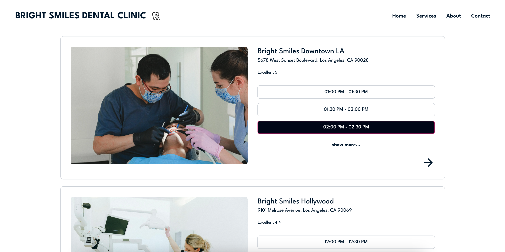
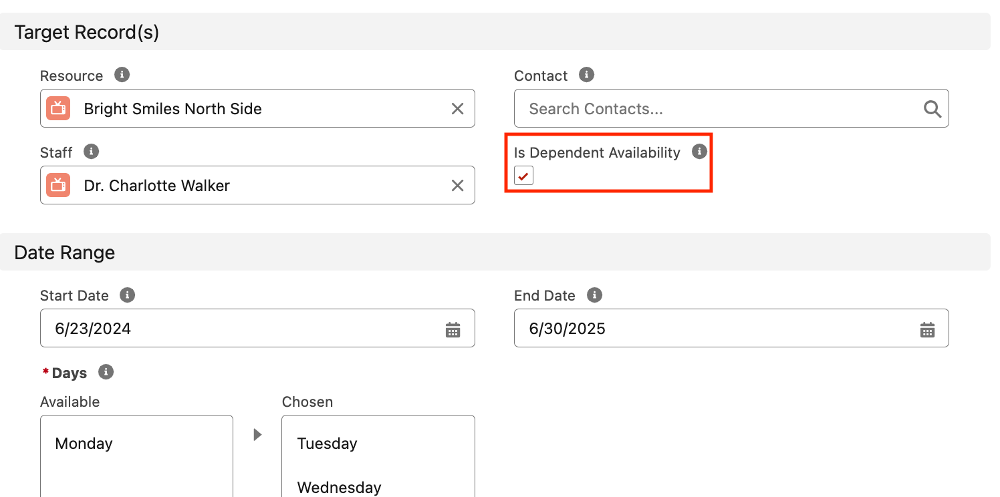

<h1 align="center">Book a Room for Student Housing</h1>

  

# Get started with the GoMeddo JS SDK

This project uses the [GoMeddo JS SDK](https://github.com/gomeddo/js-sdk) to implement an application that lets a user book a room in a student housing via [GoMeddo](https://gomeddo.com).

<!--  WE HAVE TO WAIT TILL THE REPO IS PUBLIC
 -->
<!--
## Demo

You can find a demo [here](https://gomeddo-room-and-facilities-bookings.vercel.app). -->

## High-Level Use Case

This example provides a starting point for integrating a **“Dentist Appointment Booking”** capabilities into your website using the _GoMeddo_ Javascript SDK. It focuses on booking appointment at clinics of type “Dental Checkup”, ensuring availability of both Resources (Dental Clinic) and Staff before the appointment is made.

## Overview of User Interaction on the Frontend

The application dashboard features a list of dental clinics, showcasing available reservation time slots for the current day for the specified clinic. The system gets these time slots based on the concurrent availability of both Resources (specific dental clinics) and Staff members. Users can filter their clinic search using keywords, select a specific date, choose preferred time slots (morning, afternoon, evening), and filter by price range to identify suitable appointments.

Upon selecting a desired time slot, users are directed to the booking form. Here, they can input necessary details as prompted. Following completion, users are presented with options to confirm or cancel the appointment. Upon submission, the appointment is successfully booked, and users are redirected to a confirmation page for further details.

# Step-by-Step Guide to Setting Up The Example

1. **Set Up Resources and Resource Types**:

   - Define the hierarchical structure for your Resources:
     - **Organization** > **Country** > **City** > **Clinic** > **Room**.
   - Example:
     - **Organization**: Your Organization
     - **Country**: United States Of America
     - **City**: New York
     - **Clinic**: Dental Clinic Uptown
     - **Room**: Room 101
   - Note: There can be multiple Resources of the type "Rooms", "Clinic" and, "City".

2. **Create Multi-Dimensional Availability**:

   - Set up availability for Resource (Clinic)
   - Set up availability for Staff and link it to a specific Resource(Clinic), so the staff is only available on that resource.

        

          Note: Make sure Is Dependent Availability is ticked

3. **Create Reservation Types**:

   - Define a reservation type for the appointment (e.g., Dental Checkup).

4. **Create Custom Fields Under the Objects**:

   - Add the following custom fields to the Resource object “Clinic” to provide detailed information about each Dental Clinic:

     - `Dentist_City__c` (Formula Text Field)
     - `Dentist_Location__c` (Long Text Area Field)
     - `Dentist_Rating__c` (Number Field)
     - `B25__Image_Url__c` (URL Field)
     - `B25__Default_Price__c` (Currency Field)

   - Add the following custom field to the Reservation object to provide a message for the dentist when making an appointment:

     - `Dentist_Message__c` (Long Text Area Field)

Note:

- Ensure that each resource in _GoMeddo_ is marked as '**_isActive_**' and '**_Api Visible_**' to be displayed and available through the API.
- Ensure that **Resources**, **Resource Types**, **Custom Fields** and **Reservation Types** are set up in _GoMeddo_. 

## API Key Requirement

To access to the SDK’s functionalities, an API key from _GoMeddo_ is required. For instructions on obtaining this key refer to [First time Set-up](https://gomeddo.atlassian.net/wiki/spaces/WID/pages/3353837569/First+time+Set-up). Remember to **whitelist** your domain as a part of the setup process and grant **privileged** access to the API key.

### UI Setup

The UI is built as a React website which can be accessed by users to make reservations. The code is organized as a standard React application which communicates with _GoMeddo_ to make reservations.

Perform the following steps to run the project in a local environment.

- Clone the code to a local repository
- Install necessary dependencies and packages by running `npm install`
- Start the local dev server using the command `npm run dev`

#### Link to Github and Wiki

For further information on utilizing the GoMeddo Javascript SDK, visit [GoMeddo JS SDK wiki](https://github.com/gomeddo/Room-and-Facilities-bookings).

#### Similar use cases

- Book meeting rooms for corporate events
- Reserve study rooms in libraries
- Schedule conference rooms for business meetings
- Reserve practice rooms for music students
- Book private rooms for therapy sessions
